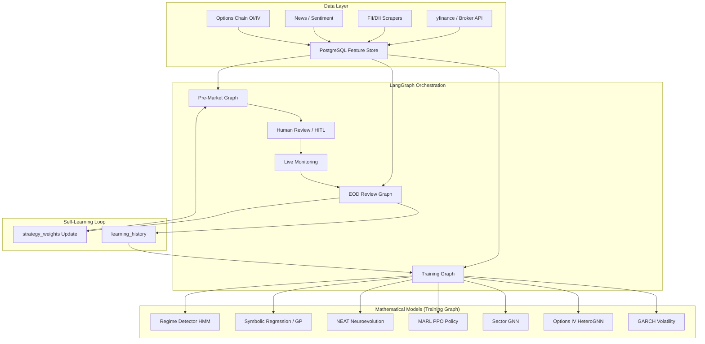

# Timm AI Trading Platform — Master Implementation Plan

Comprehensive roadmap for building a hybrid systematic + agentic trading system that combines LangGraph orchestration, mathematical models, and ML-driven strategy evolution. This plan preserves the discretionary edge (HITL + evidence chain) while adding the rigor of systematic trading (repeatable, backtestable, self-improving math signals).

---

## Architecture Overview



---

## Current State (Completed ✅)

### Core Infrastructure
- [x] LangGraph StateGraph with phased execution (pre-market → setup → review → EOD)
- [x] Shared `TradingState` with evidence chain for explainability
- [x] Conditional routing for equity intraday vs options scalping
- [x] Feedback loop updating `strategy_weights` and `learning_history`
- [x] FastAPI backend with worker management (`main.py`)
- [x] Docker Compose deployment on AWS EC2

### Analysis Nodes (Pre-Market Graph)
- [x] `swing_ta_node` — pandas-ta technical analysis (ATR, ADX, VWAP, OBV, MTFC)
- [x] `options_node` — Options chain analysis
- [x] `vector_node` — Candle vector signal processing
- [x] `global_cues_node` — SPY 200-SMA, VIX, global indices
- [x] `screener_node` — Multi-signal confluence scoring
- [x] `head_analyst_node` — LLM synthesis + morning brief
- [x] `adversarial_critic_node` — Devil's advocate debate
- [x] `judge_node` — Final arbitration with defense mode
- [x] `temporal_context_node` — Point-in-time data guardrails

### ML Training Graph (Skeleton)
- [x] `llm_hypothesis_generator_node` — Qwen2.5 strategy hypothesis generation
- [x] `evolutionary_optimizer_node` — DEAP genetic programming
- [x] `neat_neuroevolution_node` — NEAT topology evolution
- [x] `marl_training_subgraph` — PPO multi-agent RL
- [x] `sector_gnn_node` — Temporal Hetero GAT for sector rotation
- [x] `options_gnn_node` — HeteroConv for IV surface prediction

### Backtesting & Simulation
- [x] `simulate_graph.py` — Historical time-machine backtester
- [x] Point-in-time constraints (no future data leakage)
- [x] Isolated DB profiles (`simulated` vs `live`)
- [x] Auto-evaluation with T+1 performance grading

### Dashboard (Next.js)
- [x] ML Desk navigation and sector GNN visualization
- [x] Force-directed graph for sector rotation
- [x] Attention insight panel for contagion weights
- [x] Daily advisor brief and setup cards

---

## Immediate Fixes Required 🔧

> [!WARNING]
> These must be resolved before any training can proceed.

### 1. Docker Rebuild for NEAT Config
The EC2 container has a stale `neat_config.txt` missing `[DefaultReproduction]`.
```bash
docker compose build backend && docker compose up -d backend
```

### 2. Database Table Initialization
The training graph crashes because required tables don't exist yet:
- `candle_vector_signals` — Needed by GP evolution
- `evolved_strategies` — Needed by LLM hypothesis generator

**Action:** Run full data ingestion pipeline before training:
```bash
docker compose exec -T backend python seed_historical.py
docker compose exec -T backend python yfinance_producer.py
```

### 3. Ollama Model Pull
LLM hypothesis generation fails with 404. Either:
- Pull the model on EC2: `ollama pull qwen2.5-coder:14b`
- Or set `OLLAMA_URL` env var pointing to your Ollama host

---

## Phase 1: Foundation & Data Pipeline (Weeks 1–2)

> [!IMPORTANT]
> No mathematical model works without clean, versioned, point-in-time data. This is the **highest priority**.

### 1.1 Complete LangGraph Migration
- [ ] Wrap remaining RabbitMQ analysis workers as LangGraph nodes
- [ ] Retire `swing_agent_worker.py`, `options_agent_worker.py`, `screener_agent_worker.py`
- [ ] Ensure all nodes use `state['key']` dict syntax (not `state.key` dot notation)

### 1.2 Feature Store Implementation

#### [NEW] `backend/feature_store.py`
- [ ] Centralized feature computation and versioning
- [ ] Point-in-time feature retrieval (critical for backtesting integrity)
- [ ] Features to compute and store:
  - OHLCV + returns (1D, 5D, 20D rolling)
  - TA indicators: ATR(14), RSI(14), ADX(14), VWAP, OBV slope, MACD
  - Volume profile: relative volume, VWAP deviation
  - Options: PCR, max pain, IV percentile, OI concentration
  - Macro: VIX level + change, FII/DII net (5D rolling), global overnight gap
  - Sector: relative strength vs NIFTY, sector momentum rank

### 1.3 Data Quality & Ingestion
- [ ] Add data validation checks in `db_vault_worker.py` (null detection, outlier flags)
- [ ] Implement `candle_vector_signals` table creation in seed scripts
- [ ] Add `evolved_strategies` table auto-creation in evolutionary optimizer node
- [ ] Track feature freshness (stale data alerts on dashboard)

---

## Phase 2: Regime Detection Model (Weeks 2–3)

> [!TIP]
> The regime detector is the **single most impactful model** to build first. Every downstream prediction should be conditioned on regime.

### 2.1 Hidden Markov Model (HMM) Regime Detector

#### [NEW] `backend/nodes/regime_detector_node.py`
- [ ] Input features: ADX, VIX, OBV divergence, FII flow direction, ATR percentile
- [ ] Use `hmmlearn.GaussianHMM` with 4 hidden states:
  - **Trending Bull** (high ADX, low VIX, positive FII)
  - **Trending Bear** (high ADX, high VIX, negative FII)
  - **Mean-Reverting / Range** (low ADX, moderate VIX)
  - **High Volatility Expansion** (VIX spike, ATR breakout)
- [ ] Output: Current regime label + transition probability matrix
- [ ] Train on 3+ years of NIFTY daily data
- [ ] Add to `TradingState` as `detected_regime` with confidence

### 2.2 Integration
- [ ] Place regime detector as **first node** in pre-market graph (before all analysis)
- [ ] All downstream nodes condition on regime (e.g., critic applies different thresholds per regime)
- [ ] Dashboard: Regime indicator widget with historical regime timeline chart

### 2.3 Dependencies
- [ ] Add `hmmlearn` to `requirements.txt`

---

## Phase 3: Symbolic Regression / Expected Move Model (Weeks 3–5)

### 3.1 Enhance GP Evolution Node

#### [MODIFY] `backend/nodes/evolutionary_optimizer_node.py`
- [ ] Integrate `PySR` (symbolic regression) alongside DEAP for cleaner formula discovery
- [ ] Target variable: Next-day % move (or next 15-min for intraday)
- [ ] Input primitives: `raw_scalar`, `iv_adjusted_scalar`, `rsi`, `obv_slope`, `atr_pct`, `vwap_deviation`, `regime_label`
- [ ] Fitness function: Information Coefficient (IC) — rank correlation between predicted and actual move
- [ ] Store discovered formulas with human-readable expressions in `evolved_strategies` table
- [ ] Add regime-specific evolution (evolve separate formulas per regime)

### 3.2 LLM-Guided Hypothesis Seeding

#### [MODIFY] `backend/nodes/llm_hypothesis_generator_node.py`
- [ ] Feed back top-performing formulas from `evolved_strategies` into the LLM prompt
- [ ] Ask LLM to propose mutations and novel combinations
- [ ] Implement RAG over `llm_hypotheses` table for historical context
- [ ] Add fallback mode when Ollama is unavailable (use cached hypotheses from DB)

### 3.3 Dependencies
- [ ] Add `pysr` to `requirements.txt`

---

## Phase 4: Volatility Forecasting (Weeks 4–6)

### 4.1 GARCH Volatility Model

#### [NEW] `backend/nodes/volatility_forecast_node.py`
- [ ] Implement GARCH(1,1) on NIFTY returns for daily volatility forecast
- [ ] Compare realized vs implied volatility → IV premium/discount signal
- [ ] Use `arch` library for estimation
- [ ] Output: Forecasted 1D/5D volatility, IV-RV spread, vol regime
- [ ] Feed into options builder for better strike selection and sizing

### 4.2 Integration
- [ ] Add volatility forecast to `TradingState`
- [ ] Options builder uses vol forecast for expected move calculation
- [ ] Critic penalizes setups where predicted vol disagrees with trade thesis

### 4.3 Dependencies
- [ ] Add `arch` to `requirements.txt`

---

## Phase 5: Advanced ML Subgraph Hardening (Weeks 5–8)

### 5.1 NEAT Neuroevolution Polish

#### [MODIFY] `backend/nodes/neat_neuroevolution_node.py`
- [ ] Fix all `state.` → `state['']` dict access patterns
- [ ] Add graceful fallback when no training data exists (return empty network, don't crash)
- [ ] Implement fitness function tied to actual Sharpe ratio from simulated trades
- [ ] Save/load best genomes across training runs (incremental evolution)
- [ ] Visualize evolved network topologies on dashboard

### 5.2 MARL PPO Hardening

#### [MODIFY] `backend/nodes/marl_training_subgraph.py`
- [ ] Migrate from `gym` to `gymnasium` (gym is unmaintained, breaks on NumPy 2.0)
- [ ] Inject GNN-derived regime signals into observation space (already sketched)
- [ ] Add transaction cost modeling in `trading_env.py` (brokerage + slippage + STT)
- [ ] Reward shaping: Penalize drawdown, reward risk-adjusted returns (Calmar ratio)
- [ ] Implement curriculum learning: Train on easy regimes first, then hard ones
- [ ] Add position sizing as action output (not just direction)

### 5.3 Sector GNN Enhancement

#### [MODIFY] `backend/nodes/sector_gnn_node.py`
- [ ] Dynamic edge construction from rolling correlation matrix (not static adjacency)
- [ ] Add FII/DII flow as edge weights (capital flow direction between sectors)
- [ ] Temporal message passing (aggregate sector state over 5D/20D windows)
- [ ] Output: Sector rotation forecast (which sectors to rotate into/out of)

### 5.4 Options IV HeteroGNN

#### [MODIFY] `backend/nodes/options_gnn_node.py`
- [ ] Add real options chain data ingestion (not just mocked data)
- [ ] Model strike-adjacency + calendar spread edges
- [ ] Predict IV surface shift direction (expansion vs crush)
- [ ] Integrate with volatility forecast node for combined signal

---

## Phase 6: Training & Validation Infrastructure (Weeks 6–10)

> [!CAUTION]
> Without rigorous validation, all models will overfit. This phase is **non-negotiable** for production use.

### 6.1 Walk-Forward Optimization

#### [NEW] `backend/walk_forward_validator.py`
- [ ] Implement rolling window train/validate/test splits
- [ ] Train on 70% → Validate on 15% → Test on 15%
- [ ] Report metrics per split: Sharpe, Calmar, max drawdown, profit factor, edge per trade
- [ ] Regime-specific performance breakdown (don't average across regimes)

### 6.2 Backtesting Metrics Enhancement

#### [MODIFY] `backend/simulate_graph.py`
- [ ] Add transaction cost modeling (brokerage, STT, slippage estimate)
- [ ] Track max drawdown, consecutive losses, win rate by regime
- [ ] Generate equity curve and store in DB for dashboard visualization
- [ ] Add out-of-sample metrics after training completes
- [ ] Consider integrating `vectorbt` for vectorized backtesting speed

### 6.3 Position Sizing Optimization

#### [NEW] `backend/nodes/position_sizing_node.py`
- [ ] Kelly criterion implementation (with half-Kelly for safety)
- [ ] ATR-based position sizing (already partially in swing_ta_node)
- [ ] Maximum portfolio heat limit (e.g., 2% total risk at any time)
- [ ] Regime-adjusted sizing (smaller in high-vol regimes)

### 6.4 Model Registry

#### [NEW] `backend/model_registry.py`
- [ ] Track model versions, training dates, and performance metrics
- [ ] Auto-promote best models to production
- [ ] Rollback capability if live performance degrades
- [ ] Store model artifacts in S3 (or local `models/` directory)

---

## Phase 7: Dashboard & Observability (Weeks 8–12)

### 7.1 ML Training Dashboard

#### [NEW] `frontend/src/app/ml/training/page.tsx`
- [ ] Real-time training progress via SSE
- [ ] Loss curves, reward curves, fitness evolution charts
- [ ] TensorBoard-like metric comparison across training runs
- [ ] "Run Evolution Cycle" button wired to `/graph/training` endpoint

### 7.2 Backtesting Results Dashboard

#### [NEW] `frontend/src/app/ml/backtest/page.tsx`
- [ ] Equity curve visualization
- [ ] Monthly returns heatmap
- [ ] Drawdown chart
- [ ] Regime-tagged trade scatter plot
- [ ] Strategy comparison table (GP vs NEAT vs MARL vs ensemble)

### 7.3 Regime & Model Dashboard

#### [NEW] `frontend/src/app/ml/regime/page.tsx`
- [ ] Current regime indicator with historical timeline
- [ ] Regime transition probability heatmap
- [ ] Model confidence over time chart
- [ ] Feature importance / SHAP values visualization

### 7.4 Evolved Strategies Gallery

#### [NEW] `frontend/src/app/ml/strategies/page.tsx`
- [ ] Display discovered GP formulas in human-readable math notation
- [ ] NEAT network topology visualization
- [ ] Strategy performance cards (Sharpe, win rate, regime affinity)
- [ ] "Promote to Live" button for HITL approval

---

## Phase 8: AWS Production Deployment (Weeks 10–14)

### 8.1 Training Pipeline on AWS
- [ ] Migrate training graph to run on EC2 GPU instances (g4dn.xlarge for T4 GPU)
- [ ] Use spot instances for cost control (~70% savings)
- [ ] Schedule nightly training via `scheduler_worker.py` (post-market hours)
- [ ] Store model artifacts in S3 with versioning
- [ ] LangGraph loads latest model from S3 at runtime

### 8.2 Orchestration
- [ ] AWS Batch or Step Functions for daily simulation + retraining pipeline
- [ ] CloudWatch alerts for training failures, model degradation
- [ ] Cost monitoring dashboard (GPU hours, S3 storage)

### 8.3 Inference Optimization
- [ ] `torch.compile()` for GNN and NEAT inference models
- [ ] Model quantization (INT8) for faster CPU inference during pre-market
- [ ] Lambda functions for lightweight inference API (optional)

---

## Phase 9: Advanced Research (Weeks 12+, Ongoing)

### 9.1 LLM Fine-Tuning
- [ ] Fine-tune small model (LoRA on Qwen/Llama) on `trade_journal` + `evidence_chain`
- [ ] Improve JSON output quality and domain-specific reasoning
- [ ] Train on historical analyst briefs for better synthesis

### 9.2 Ensemble Meta-Learner
- [ ] Stacking model that combines GP, NEAT, MARL, GNN predictions
- [ ] Dynamic weighting based on regime and recent performance
- [ ] The "meta-judge" that learns which model to trust when

### 9.3 Order Flow & Microstructure
- [ ] Integrate Level 2 / order book data (if available from broker)
- [ ] Model bid-ask spread dynamics
- [ ] Detect large block trades and institutional footprint

### 9.4 Alternative Data
- [ ] Satellite data for commodity-linked sectors (agriculture, metals)
- [ ] Social media sentiment (Twitter/X mentions, Reddit wsb-India)
- [ ] Earnings surprise predictor from financial filings

### 9.5 Cross-Market Signals
- [ ] SGX Nifty → NIFTY open prediction
- [ ] US futures (ES, NQ) → Indian IT/pharma sector signal
- [ ] Dollar index (DXY) → FII flow prediction model

---

## Key Design Principles

| Principle | Implementation |
|---|---|
| **No future data leakage** | `temporal_context_node` + point-in-time feature store |
| **Regime conditioning** | All models output regime-tagged predictions |
| **HITL preserved** | LangGraph debate → human review → accept/skip/modify |
| **Transaction costs** | All backtests include brokerage + STT + slippage |
| **Graceful degradation** | Every ML node has a fallback path (return empty, don't crash) |
| **Incremental evolution** | Models improve nightly, never reset from scratch |
| **Explainability** | Evidence chain, SHAP values, formula display |

---

## Dependencies Summary

```
# Phase 1 (existing)
langgraph, langchain-core, langchain-community
pandas, pandas-ta, numpy, scipy
psycopg2-binary, fastapi, uvicorn
torch, torch-geometric
deap, neat-python, stable-baselines3
yfinance, pika, httpx

# Phase 2
hmmlearn                    # Regime detection (HMM)

# Phase 3
pysr                        # Symbolic regression

# Phase 4
arch                        # GARCH volatility modeling

# Phase 5
gymnasium                   # Replace deprecated gym

# Phase 6
vectorbt                    # Fast vectorized backtesting (optional)
```

---

## Verification Plan

### Automated Tests
1. `python simulate_graph.py --start-date 2023-01-01 --end-date 2025-12-31` — Full historical walkthrough
2. `python run_graph.py --phase training` — End-to-end training pipeline
3. Walk-forward validation with OOS Sharpe > 0.5 as minimum bar
4. Regime detection accuracy vs manually labeled periods

### Manual Verification
1. Review evolved GP formulas for financial intuition (no nonsensical expressions)
2. Compare NEAT/MARL recommendations against experienced trader intuition
3. Dashboard visual inspection for all ML panels
4. Paper trading for 30 days before any live capital allocation
