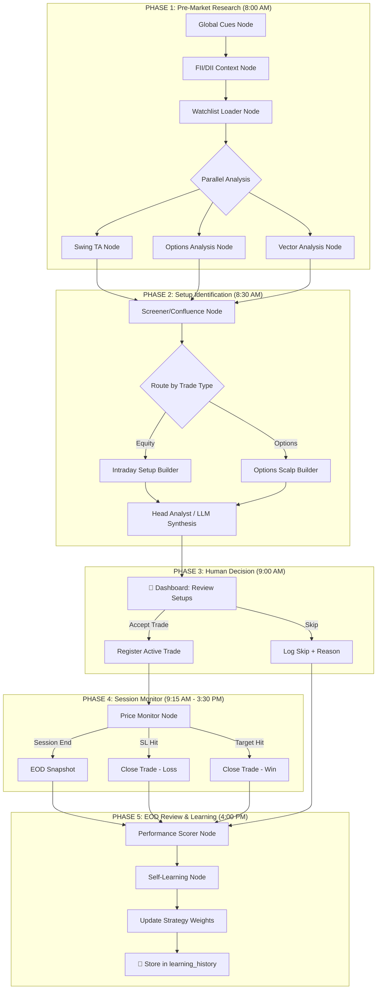

# TIMM → LangGraph Agentic Workflow Redesign

## The Big Picture: Why LangGraph?

Your current system is a **collection of independent workers** that communicate via RabbitMQ. They run in isolation — each agent does its job, publishes a message, and hopes someone downstream picks it up. There's no orchestration, no shared state, no ability to make a coordinated decision across agents.

**LangGraph changes this fundamentally:**

```
CURRENT: Workers → RabbitMQ → Workers → DB (hope for the best)
FUTURE:  LangGraph Graph → Shared State → Coordinated Decision → Your Dashboard
```

### What You Gain

| Problem Today | LangGraph Solution |
|---|---|
| Agents run independently, no coordination | **StateGraph** orchestrates all agents in a deterministic DAG — each agent contributes to shared state |
| Daily report is a monolithic script | **Phased graph execution** — Research → Screening → Synthesis → Recommendation, each testable independently |
| No way to track "I took this trade" | **Human-in-the-Loop (HITL)** — graph pauses, waits for your trade confirmation, then resumes monitoring |
| No self-learning from outcomes | **Feedback loop node** — EOD review compares predictions vs reality, stores learnings that feed future analysis |
| Options scalping is not separated from intraday | **Conditional routing** — two parallel sub-graphs: one for equity intraday (long/short), one for options (buy calls/puts) |
| Can't explain WHY a trade was recommended | **Evidence chain** — every node appends its reasoning to a shared `evidence[]` array that justifies the final output |

---

## Architecture Overview



---

## User Review Required

> [!IMPORTANT]
> **Trade Type Separation**: I'm designing TWO parallel pipelines:
> 1. **Intraday Equity** — can go LONG or SHORT, targets 2-3% moves
> 2. **Options Scalping** — can only BUY CALLS or BUY PUTS, near-expiry or expiry day
> 
> Both run in the same LangGraph graph but diverge at the "Route by Trade Type" conditional edge. **Is this the right separation?**

> [!WARNING]
> **Migration Strategy**: This redesign will **replace** the existing `daily_report_generator.py` with a LangGraph-based orchestrator. The individual analysis functions (`analyze_swing_setups`, `analyze_option_chain`, etc.) will be **preserved and wrapped** as LangGraph nodes — we're not rewriting your TA logic. RabbitMQ workers (vault, monitor) will continue to run alongside LangGraph. **Are you comfortable with this approach?**

> [!IMPORTANT]
> **Self-Learning Scope**: The self-learning node will track:
> - Which signals led to winning vs losing trades
> - Signal confidence accuracy (predicted 80% confidence, actual win rate was 55%)
> - Time-of-day effectiveness (morning setups vs afternoon)
> - Which factors (FII flow, VIX, sector strength) actually correlated with wins
> 
> This data will adjust **confidence scoring weights** over time. It will NOT autonomously change entry/SL/target logic — that stays deterministic. **Does this match your expectation?**

---

## Proposed Changes

### Component 1: LangGraph Core — State & Graph Definition

#### [NEW] [langgraph_state.py](file:///c:/Users/blkhrt/Documents/git/Timm/backend/langgraph_state.py)

The shared state object that flows through the entire graph:

```python
from typing import TypedDict, Optional, Annotated
from operator import add

class TradingState(TypedDict):
    # ── Phase 1: Context ──
    report_date: str
    market_regime: str          # RISK_ON / RISK_OFF / NEUTRAL
    vix: Optional[float]
    fii_net: Optional[str]
    dii_net: Optional[str]
    global_cues: dict           # Full global context
    sector_leaders: list[dict]
    watchlist: list[str]        # Active symbols

    # ── Phase 1: Analysis Results ──
    swing_analyses: dict        # {symbol: swing_report}
    options_analyses: dict      # {symbol: options_report}
    vector_analyses: dict       # {symbol: vector_report}

    # ── Phase 2: Setups ──
    intraday_setups: list[dict]     # Equity long/short setups
    options_setups: list[dict]      # Options scalp setups (calls/puts)
    all_evidence: Annotated[list[dict], add]  # Every factor that led to a recommendation

    # ── Phase 2: Synthesis ──
    top_picks: list[dict]       # Ranked trade recommendations
    avoid_list: list[str]
    head_analyst_brief: Optional[str]

    # ── Phase 3: Human Decision ──
    accepted_trades: list[dict]     # Trades the user chose to take
    skipped_trades: list[dict]      # Trades the user passed on (with reasons)

    # ── Phase 4: Session ──
    active_trade_status: dict       # Live P&L tracking

    # ── Phase 5: EOD ──
    eod_results: list[dict]         # Final P&L per trade
    learning_updates: list[dict]    # What the system learned today

    # ── Meta ──
    errors: Annotated[list[str], add]
    current_phase: str
```

---

#### [NEW] [langgraph_workflow.py](file:///c:/Users/blkhrt/Documents/git/Timm/backend/langgraph_workflow.py)

The main LangGraph `StateGraph` definition:

```python
from langgraph.graph import StateGraph, END
from langgraph_state import TradingState

# Import node functions
from nodes.global_cues_node import global_cues_node
from nodes.fii_dii_node import fii_dii_node
from nodes.watchlist_node import watchlist_node
from nodes.swing_ta_node import swing_ta_node
from nodes.options_node import options_analysis_node
from nodes.vector_node import vector_analysis_node
from nodes.screener_node import screener_node
from nodes.intraday_builder_node import intraday_builder_node
from nodes.options_builder_node import options_builder_node
from nodes.head_analyst_node import head_analyst_node
from nodes.eod_review_node import eod_review_node
from nodes.self_learning_node import self_learning_node

def build_trading_graph() -> StateGraph:
    graph = StateGraph(TradingState)

    # ── Phase 1: Research ──
    graph.add_node("global_cues", global_cues_node)
    graph.add_node("fii_dii", fii_dii_node)
    graph.add_node("load_watchlist", watchlist_node)
    graph.add_node("swing_analysis", swing_ta_node)
    graph.add_node("options_analysis", options_analysis_node)
    graph.add_node("vector_analysis", vector_analysis_node)

    # ── Phase 2: Synthesis ──
    graph.add_node("screener", screener_node)
    graph.add_node("intraday_builder", intraday_builder_node)
    graph.add_node("options_builder", options_builder_node)
    graph.add_node("head_analyst", head_analyst_node)

    # ── Phase 5: EOD ──
    graph.add_node("eod_review", eod_review_node)
    graph.add_node("self_learning", self_learning_node)

    # ── Edges ──
    graph.set_entry_point("global_cues")
    graph.add_edge("global_cues", "fii_dii")
    graph.add_edge("fii_dii", "load_watchlist")

    # Parallel analysis (fan-out)
    graph.add_edge("load_watchlist", "swing_analysis")
    graph.add_edge("load_watchlist", "options_analysis")
    graph.add_edge("load_watchlist", "vector_analysis")

    # Convergence (fan-in)
    graph.add_edge("swing_analysis", "screener")
    graph.add_edge("options_analysis", "screener")
    graph.add_edge("vector_analysis", "screener")

    # Route to trade type builders
    graph.add_edge("screener", "intraday_builder")
    graph.add_edge("screener", "options_builder")

    # Converge to synthesis
    graph.add_edge("intraday_builder", "head_analyst")
    graph.add_edge("options_builder", "head_analyst")

    # HEAD ANALYST → END (Phase 2 complete — dashboard picks up from here)
    graph.add_edge("head_analyst", END)

    # EOD sub-graph (triggered separately after market close)
    # eod_review → self_learning → END

    return graph.compile()
```

---

#### [NEW] [nodes/](file:///c:/Users/blkhrt/Documents/git/Timm/backend/nodes/) — Node function directory

Each node is a thin wrapper around your existing analysis logic:

| Node File | Wraps | What It Does |
|---|---|---|
| `nodes/__init__.py` | — | Package init |
| `nodes/global_cues_node.py` | `_fetch_global_context()` from daily_report | Fetches VIX, SPY, GIFT Nifty, bias → writes to `state.global_cues` |
| `nodes/fii_dii_node.py` | DB query | Fetches FII/DII flows + sector data → writes to `state.fii_net`, `state.sector_leaders` |
| `nodes/watchlist_node.py` | `_fetch_watchlist()` | Loads active symbols → writes to `state.watchlist` |
| `nodes/swing_ta_node.py` | `analyze_swing_setups()` from `swing_agent_ta.py` | Runs swing TA on each symbol → writes to `state.swing_analyses` |
| `nodes/options_node.py` | `analyze_option_chain()` from `options_agent_worker.py` | Runs options chain analysis → writes to `state.options_analyses` |
| `nodes/vector_node.py` | `SymbolEngine.process_candle()` from `candle_vector_agent.py` | Runs vector analysis → writes to `state.vector_analyses` |
| `nodes/screener_node.py` | Confluence scoring logic | Combines all analyses, scores setups → routes to builders |
| `nodes/intraday_builder_node.py` | New | Builds equity intraday setups with entry/SL/target + evidence chain |
| `nodes/options_builder_node.py` | New | Builds options scalp setups (buy call/put) + evidence chain |
| `nodes/head_analyst_node.py` | `generate_market_brief()` from `head_analyst_worker.py` | LLM synthesis with full context → final recommendations |
| `nodes/eod_review_node.py` | New | Compares predictions vs actual outcomes |
| `nodes/self_learning_node.py` | New | Updates strategy weights based on trade outcomes |

---

### Component 2: Options Scalping Builder

#### [NEW] [nodes/options_builder_node.py](file:///c:/Users/blkhrt/Documents/git/Timm/backend/nodes/options_builder_node.py)

This is entirely new — builds options scalping setups specifically:

```python
def options_builder_node(state: TradingState) -> dict:
    """
    Build options scalp recommendations from confluence data.
    
    Rules (your trading style):
    - Only BUY CALLS or BUY PUTS (no selling/writing)
    - Prefer near-expiry or expiry day for max gamma
    - Entry based on: underlying trend + OI walls + expected move
    - SL = 30% of premium paid
    - Target = 50-100% of premium paid
    """
    setups = []
    
    for symbol, swing in state["swing_analyses"].items():
        options = state["options_analyses"].get(symbol)
        if not options or not swing:
            continue
        
        signal_type = swing.get("signal_type")
        confidence = swing.get("confidence", 0)
        
        if confidence < 50:
            continue
        
        # Determine call/put based on confluence
        if signal_type == "BULLISH":
            option_type = "BUY_CALL"
            strike_ref = options.get("put_wall")  # Enter near support
        elif signal_type == "BEARISH":
            option_type = "BUY_PUT"
            strike_ref = options.get("call_wall")  # Enter near resistance
        else:
            continue
        
        evidence = [
            f"Swing TA: {signal_type} with {len(swing.get('signals', []))} signals",
            f"Options verdict: {options.get('verdict')}",
            f"Max Pain: ₹{options.get('max_pain')} | Expected Move: ±{options.get('expected_move_pct')}%",
            f"PCR: {options.get('pcr_volume')} | Call Wall: {options.get('call_wall')} | Put Wall: {options.get('put_wall')}",
        ]
        
        setups.append({
            "symbol": symbol,
            "trade_type": "OPTIONS_SCALP",
            "option_action": option_type,
            "underlying_price": swing.get("close_price"),
            "confidence": confidence,
            "strike_reference": strike_ref,
            "max_pain": options.get("max_pain"),
            "expected_move_pct": options.get("expected_move_pct"),
            "evidence": evidence,
        })
    
    return {"options_setups": setups}
```

---

### Component 3: Self-Learning System

#### [NEW] [nodes/self_learning_node.py](file:///c:/Users/blkhrt/Documents/git/Timm/backend/nodes/self_learning_node.py)

The self-learning node runs at EOD to analyze today's performance:

```python
def self_learning_node(state: TradingState) -> dict:
    """
    EOD Self-Learning:
    1. Compare each recommendation's prediction vs actual outcome
    2. Score signal accuracy (which signals were right?)
    3. Update confidence weights in the learning_history table
    4. Feed back into future screener_node confidence scoring
    """
    learnings = []
    
    for trade in state.get("eod_results", []):
        predicted_direction = trade["predicted_direction"]
        actual_pnl = trade["actual_pnl_pct"]
        signals_used = trade["signals_used"]
        
        was_correct = (
            (predicted_direction == "BULLISH" and actual_pnl > 0) or
            (predicted_direction == "BEARISH" and actual_pnl < 0)
        )
        
        # Score each signal that contributed
        for signal in signals_used:
            learnings.append({
                "signal_type": signal,
                "predicted_direction": predicted_direction,
                "was_correct": was_correct,
                "actual_pnl_pct": actual_pnl,
                "date": state["report_date"],
                "market_regime": state.get("market_regime"),
                "vix_at_time": state.get("vix"),
            })
    
    # Also learn from SKIPPED trades (did we miss a good one?)
    for skip in state.get("skipped_trades", []):
        # Check what actually happened to skipped stocks
        # ...
    
    return {"learning_updates": learnings}
```

---

### Component 4: New Database Tables

#### [NEW] Database migrations for learning system

```sql
-- Trade journal: tracks every trade you take through the system
CREATE TABLE trade_journal (
    id SERIAL PRIMARY KEY,
    trade_date DATE NOT NULL,
    symbol VARCHAR(50) NOT NULL,
    trade_type VARCHAR(30) NOT NULL,        -- 'INTRADAY_LONG', 'INTRADAY_SHORT', 'OPTIONS_CALL', 'OPTIONS_PUT'
    entry_price REAL NOT NULL,
    exit_price REAL,
    stoploss REAL,
    target REAL,
    actual_pnl_pct REAL,
    status VARCHAR(20) DEFAULT 'OPEN',      -- 'OPEN', 'SL_HIT', 'TARGET_HIT', 'MANUAL_EXIT', 'EXPIRED'
    predicted_confidence REAL,              -- What the system predicted
    signals_used JSONB,                     -- Signals that generated this recommendation
    evidence_chain JSONB,                   -- Full evidence trail from every node
    user_notes TEXT,                        -- Your notes when entering the trade
    entered_at TIMESTAMP DEFAULT NOW(),
    exited_at TIMESTAMP,
    session_type VARCHAR(20),               -- 'MORNING', 'AFTERNOON', 'EXPIRY'
    created_at TIMESTAMP DEFAULT NOW()
);

-- Learning history: stores what the system learned from each trade
CREATE TABLE learning_history (
    id SERIAL PRIMARY KEY,
    trade_date DATE NOT NULL,
    signal_type VARCHAR(100) NOT NULL,      -- e.g., 'BB_SQUEEZE', 'GOLDEN_CROSS', 'VOLUME_SPIKE'
    predicted_direction VARCHAR(10),
    was_correct BOOLEAN,
    actual_pnl_pct REAL,
    market_regime VARCHAR(20),
    vix_at_time REAL,
    trade_type VARCHAR(30),                 -- 'INTRADAY' or 'OPTIONS'
    session_type VARCHAR(20),               -- 'MORNING', 'AFTERNOON', 'EXPIRY'
    created_at TIMESTAMP DEFAULT NOW()
);

-- Strategy weights: adjustable confidence multipliers per signal
CREATE TABLE strategy_weights (
    id SERIAL PRIMARY KEY,
    signal_type VARCHAR(100) UNIQUE NOT NULL,
    base_weight REAL DEFAULT 1.0,           -- System-calculated weight
    user_override REAL,                     -- Your manual override (if any)
    win_count INTEGER DEFAULT 0,
    loss_count INTEGER DEFAULT 0,
    avg_pnl_when_correct REAL,
    avg_pnl_when_wrong REAL,
    last_updated TIMESTAMP DEFAULT NOW()
);

-- Graph runs: tracks every LangGraph execution
CREATE TABLE graph_runs (
    id SERIAL PRIMARY KEY,
    graph_type VARCHAR(30) NOT NULL,        -- 'PREMARKET', 'EOD_REVIEW', 'INTRADAY_MONITOR'
    run_date DATE NOT NULL,
    started_at TIMESTAMP DEFAULT NOW(),
    finished_at TIMESTAMP,
    duration_ms INTEGER,
    state_snapshot JSONB,                   -- Full serialized graph state
    phase_completed VARCHAR(30),            -- Last phase completed
    total_setups INTEGER,
    total_accepted INTEGER,
    status VARCHAR(20) DEFAULT 'RUNNING',
    error_message TEXT,
    created_at TIMESTAMP DEFAULT NOW()
);
```

---

### Component 5: API Endpoints for Human-in-the-Loop

#### [MODIFY] [main.py](file:///c:/Users/blkhrt/Documents/git/Timm/backend/main.py)

Add new endpoints for the LangGraph workflow:

```python
# ── LangGraph Workflow Endpoints ──

@app.post("/graph/premarket")
def trigger_premarket_analysis():
    """Trigger the pre-market research + setup identification graph."""
    # Runs Phase 1 + Phase 2, stores results in DB
    # Dashboard polls /graph/setups to see recommendations

@app.get("/graph/setups")
def get_today_setups():
    """Get today's trade setups (for dashboard display)."""
    # Returns intraday_setups + options_setups with evidence chains

@app.post("/graph/accept-trade")
def accept_trade(trade_data: dict):
    """Human confirms a trade entry — system starts monitoring."""
    # Inserts into trade_journal
    # Resumes the graph into Phase 4 (monitoring)

@app.post("/graph/skip-trade")
def skip_trade(trade_data: dict):
    """Human skips a trade — logged for learning."""
    # Inserts into skipped_trades with optional reason

@app.post("/graph/eod-review")
def trigger_eod_review():
    """Trigger EOD review + self-learning graph."""
    # Runs Phase 5: performance scoring + learning updates

@app.get("/graph/learning-stats")
def get_learning_stats():
    """Get the system's learning statistics."""
    # Returns signal accuracy, win rates, weight adjustments
```

---

### Component 6: Scheduler Integration

#### [MODIFY] [scheduler_worker.py](file:///c:/Users/blkhrt/Documents/git/Timm/backend/scheduler_worker.py)

Replace the `daily_report` job with the LangGraph workflow:

```python
JOB_REGISTRY = {
    # ... existing jobs ...
    
    "premarket_graph": {
        "script": "run_graph.py",
        "args": ["--phase", "premarket"],
        "description": "LangGraph Pre-Market Analysis",
        "cron": {"hour": "8", "minute": "0", "day_of_week": "mon-fri"},
        "category": "agent",
    },
    "eod_review_graph": {
        "script": "run_graph.py",
        "args": ["--phase", "eod"],
        "description": "LangGraph EOD Review + Learning",
        "cron": {"hour": "16", "minute": "30", "day_of_week": "mon-fri"},
        "category": "agent",
    },
}
```

#### [NEW] [run_graph.py](file:///c:/Users/blkhrt/Documents/git/Timm/backend/run_graph.py)

CLI entry point for triggering graph phases:

```python
"""CLI entry point for LangGraph workflow execution."""
import sys
import argparse
from langgraph_workflow import build_trading_graph
from datetime import datetime
from zoneinfo import ZoneInfo

def main():
    parser = argparse.ArgumentParser()
    parser.add_argument("--phase", choices=["premarket", "eod"], required=True)
    args = parser.parse_args()

    graph = build_trading_graph()
    today = datetime.now(ZoneInfo("Asia/Kolkata")).strftime("%Y-%m-%d")

    if args.phase == "premarket":
        initial_state = {
            "report_date": today,
            "current_phase": "premarket",
            # ... minimal initial state
        }
        result = graph.invoke(initial_state)
        # Store result in graph_runs table + daily_reports table
        
    elif args.phase == "eod":
        # Load today's accepted trades from trade_journal
        # Run EOD review sub-graph
        pass

if __name__ == "__main__":
    main()
```

---

### Component 7: Existing Workers — What Stays, What Changes

| File | Action | Reason |
|---|---|---|
| `swing_agent_ta.py` | **KEEP AS-IS** | Its `analyze_swing_setups()` function is called by `swing_ta_node.py` |
| `options_agent_worker.py` | **KEEP AS-IS** | Its `analyze_option_chain()` function is called by `options_node.py` |
| `candle_vector_agent.py` | **KEEP AS-IS** | Its `SymbolEngine` class is imported by `vector_node.py` |
| `head_analyst_worker.py` | **KEEP AS-IS** | Its `generate_market_brief()` is called by `head_analyst_node.py` |
| `daily_report_generator.py` | **DEPRECATED** | Replaced by `langgraph_workflow.py` (does everything it does + more) |
| `screener_agent_worker.py` | **KEEP AS-IS** | Screening logic reused; RabbitMQ worker survives for real-time mode |
| `db_vault_worker.py` | **KEEP AS-IS** | Still ingests RabbitMQ messages to DB |
| `price_monitor_worker.py` | **KEEP AS-IS** | Still monitors active trades in real-time |
| `scheduler_worker.py` | **MODIFY** | Replace `daily_report` with `premarket_graph` + `eod_review_graph` |
| `main.py` | **MODIFY** | Add LangGraph API endpoints |

---

## File Tree (New Files)

```
backend/
├── langgraph_state.py          # Shared TradingState TypedDict
├── langgraph_workflow.py        # StateGraph definition + compilation
├── run_graph.py                # CLI entry point
├── nodes/
│   ├── __init__.py
│   ├── global_cues_node.py
│   ├── fii_dii_node.py
│   ├── watchlist_node.py
│   ├── swing_ta_node.py
│   ├── options_node.py
│   ├── vector_node.py
│   ├── screener_node.py
│   ├── intraday_builder_node.py
│   ├── options_builder_node.py
│   ├── head_analyst_node.py
│   ├── eod_review_node.py
│   └── self_learning_node.py
├── migrations/
│   └── 004_langgraph_tables.sql  # New DB tables
```

---

## Execution Order

> [!IMPORTANT]
> **We build in 4 phases, each producing a testable, working system:**

### Phase A: Foundation (First)
1. Install `langgraph` dependency
2. Create `langgraph_state.py` (state definition)
3. Create `nodes/` directory with all node files (wrapping existing logic)
4. Create `langgraph_workflow.py` (graph definition)
5. Create `run_graph.py` (CLI runner)
6. Test: `python run_graph.py --phase premarket` produces a structured report

### Phase B: Trade Type Routing
7. Create `nodes/intraday_builder_node.py` (equity long/short setups)
8. Create `nodes/options_builder_node.py` (options scalp setups)
9. Add conditional routing in the graph
10. Test: Graph produces separate intraday + options recommendations

### Phase C: Human-in-the-Loop + Monitoring
11. Run DB migrations (trade_journal, learning_history, strategy_weights, graph_runs)
12. Add API endpoints to `main.py` (accept/skip trade, get setups)
13. Wire up price_monitor integration for accepted trades
14. Test: Accept a trade via API → trade appears in trade_journal → price monitor tracks it

### Phase D: Self-Learning
15. Create `nodes/eod_review_node.py`
16. Create `nodes/self_learning_node.py`
17. Build the EOD sub-graph
18. Wire strategy_weights into screener_node confidence scoring
19. Test: Run EOD review → learning_history gets populated → next day's confidence scores reflect learnings

---

## Open Questions

> [!IMPORTANT]
> **Options Scalping Details**: For options scalping, do you want:
> - Only NIFTY/BANKNIFTY options, or also stock options?
> - Specific strike selection logic (ATM, 1 OTM, etc.)?
> - Max premium per lot as a risk limit?

> [!IMPORTANT]
> **Trade Count**: You mentioned "2 major trades intraday" — should the system cap recommendations at 2 per day (1 equity + 1 options), or show more and let you pick 2?

> [!WARNING]
> **RabbitMQ Coexistence**: The real-time RabbitMQ workers (db_vault, price_monitor, screener in live mode) will continue running alongside LangGraph. LangGraph handles the *batch orchestration* flow (pre-market analysis, EOD review). RabbitMQ handles *real-time event streaming* (price alerts, live screener). **Does this dual architecture make sense to you, or do you want to fully migrate off RabbitMQ?**

> [!IMPORTANT]
> **Dashboard Integration**: The dashboard will need new pages/components to:
> 1. Display today's setups with evidence chains
> 2. Accept/Skip trade buttons
> 3. Show learning statistics over time
> This is a separate frontend task after the backend is built. **Should I plan for that now or handle it after the backend is done?**

---

## Verification Plan

### Automated Tests
- `python run_graph.py --phase premarket` completes without errors
- Graph produces structured output with both `intraday_setups` and `options_setups`
- Evidence chains contain entries from every analysis node
- API endpoints return correct data
- EOD review correctly compares predictions vs actuals
- Strategy weights update correctly based on trade outcomes

### Manual Verification
- Trigger pre-market graph → review setups on dashboard
- Accept a test trade → verify it appears in trade_journal
- Wait for price monitor to update P&L
- Trigger EOD review → verify learning_history populated
- Next day: verify confidence scores reflect updated weights
